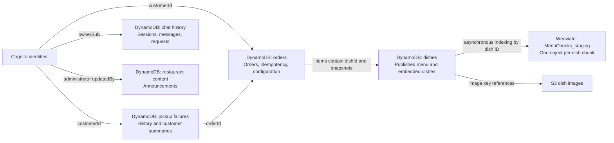

# Database design

This describes the implemented project schema as of 2026-09-21. Staging names come from local Terraform outputs; record layouts come from the application writers and validators. It documents the source configuration, rather than a live database inspection.

The project uses **Amazon DynamoDB with five tables** and **Weaviate with one menu-chunk collection per stage**. Cognito manages identities, and S3 stores image objects. No SQL database is configured in the project Terraform.

## Storage inventory

All DynamoDB key attributes below are strings. Attribute names are case-sensitive: chat uses `PK`/`SK`, while restaurant content uses `pk`/`sk`.

| Store | Staging name | Partition key | Sort key | Contents |
|---|---|---|---|---|
| DynamoDB | `dishes-table-staging` | `id` | None | Published menu with embedded dish records; legacy individual dish records |
| DynamoDB | `orders-table-staging` | `orderId` | None | Orders, request-idempotency records, ordering configuration |
| DynamoDB | `sushi-menu-api-staging-customer-pickup-failures` | `customerId` | `recordKey` | Failure history and one summary per customer |
| DynamoDB | `sushi-menu-api-staging-restaurant-content` | `pk` | `sk` | Announcements |
| DynamoDB | `sushi-menu-api-staging-chat-history` | `PK` | `SK` | Chat sessions, messages, completed request records |
| Weaviate | `MenuChunks_staging` | Object UUID | Not applicable | Menu chunks, metadata, embeddings, reranking text |

Names vary by deployment stage and configured service/table prefixes. The actual values above are the staging names recorded locally.

## Logical relationships

Arrows show application references or data derivation. These are not relational foreign-key constraints.

The chat Lambda searches Weaviate, reloads current matching dish data from DynamoDB, generates an answer, and stores the exchange in chat history. The vector collection does not store chat sessions.

## 1. Dishes

**Table:** `dishes-table-staging`. **Key:** `id`.

The current published menu is one aggregate item. Its embedded dishes are not separate DynamoDB rows in this layout.

| Field | Type | Meaning |
|---|---|---|
| `id` | String | Fixed value `MENU#CURRENT` |
| `items` | List of maps | Published dishes |
| `version` | Number | Menu-save timestamp in milliseconds |
| `updatedAt` | String | UTC ISO timestamp |
| `updatedBy` | String | Administrator's Cognito subject |

Each map in `items` has this shape:

| Field | Type | Meaning |
|---|---|---|
| `id` | String | Stable dish ID; logical reference used by order items and vector chunks |
| `category`, `name`, `description` | Strings | Menu presentation and retrieval metadata |
| `price` | String | Nonnegative decimal price, such as `"12.50"` |
| `availability` | String | `available` or `out`; defaults to `available` during validation |
| `allergens` | List of strings, optional | Validated allergen identifiers |
| `fullDishInfo` | String, optional | Private dish context used for RAG; up to 4,000 characters |
| `image` | Map, optional | S3 image metadata: `key`, `alt`, `width`, `height` |

Allergen identifiers are `fish`, `shellfish`, `milk`, `egg`, `peanut`, `tree-nuts`, `wheat`, `soy`, and `sesame`; legacy `gluten` input is normalized to `wheat`. The complete-menu payload accepts 1–50 dishes and requires distinct dish IDs.

The older single-dish write path stores a dish directly under `id = <dishId>`. Menu readers prefer `MENU#CURRENT` when present and fall back to individual dish rows when the aggregate is absent. Legacy `ragInfo` can be read as `fullDishInfo`.

**Access:** public/private menu reads load the aggregate by key. Complete-menu replacement overwrites `MENU#CURRENT`; the single-dish route writes by dish ID. Public menu responses omit `fullDishInfo`.

**Indexes and events:** no GSI, LSI, or TTL. A `NEW_AND_OLD_IMAGES` stream detects menu changes and feeds asynchronous Weaviate indexing and image-cleanup work. Full-menu saves have no request-ID deduplication or expected-version condition.

Sources: [table definition](terraform/main.tf), [menu writer](terraform/lambda/handler/replace-dishes.js), [dish validation](terraform/lambda/handler/validate-dish.js), [menu validation](terraform/lambda/handler/validate-menu.js), [menu reader](terraform/lambda/handler/get-dishes.js).

## 2. Orders

**Table:** `orders-table-staging`. **Key:** `orderId`. Three kinds of item share this table.

| Item type | `orderId` pattern | `entityType` |
|---|---|---|
| Order | `ord_<UUID>` | `ORDER` |
| Idempotency record | `IDEMPOTENCY#<customerId>#<clientRequestId>` | `IDEMPOTENCY` |
| Ordering configuration | `CONFIG#ORDERING` | `ORDERING_CONFIG` |

### Order item

| Fields | Type | Meaning |
|---|---|---|
| `orderId`, `entityType`, `eventType` | Strings | ID, `ORDER`, and `ORDER_CREATED` |
| `status` | String | Initially `PENDING`; valid values also include `CONFIRMED`, `CANCELLED`, `REJECTED`, `FAILED_TO_PICKUP` |
| `customerId` | String | Authenticated customer's Cognito subject |
| `customerOrderKey` | String | `CUSTOMER#<customerId>`; customer GSI partition key |
| `customerEmail` | String, optional | Email captured from the authenticated identity |
| `clientRequestId`, `requestHash` | Strings | Creation request ID and SHA-256 hash of its normalized payload |
| `fulfillment` | String | `PICKUP` |
| `pickupContact` | Map | `{ name: String, phoneNumber: String }` |
| `items` | List of maps | Order-line snapshots described below |
| `itemCount` | Number | Sum of quantities |
| `currency` | String | `USD` |
| `subtotalCents`, `totalCents` | Numbers | Integer monetary amounts in cents |
| `customerNote` | String | Customer's order note |
| `createdAt`, `updatedAt` | Strings | UTC ISO timestamps |
| `menuVersion` | Number, optional | Menu version used for creation |
| `notificationStatus` | String | Initially `PENDING`, later `SENT` for the administrator order email |
| `notificationSentAt`, `notificationMessageId` | Strings, optional | Administrator email delivery metadata |
| `statusUpdatedAt`, `statusUpdatedBy` | Strings, optional | Status change timestamp and administrator identity |
| `pickupTime`, `restaurantNote` | Strings, conditional | Scheduled time for confirmed orders; restaurant note when supplied |
| `failedToPickupAt`, `failedToPickupMarkedBy` | Strings, conditional | Failure timestamp and recording administrator |
| `scheduledPickupTime`, `pickupFailureRecordKey` | Strings, conditional | Preserved scheduled time and reference to the failure-history row |

Each order line embeds `dishId`, `name`, and `category` as strings, plus `quantity`, `unitPriceCents`, and `lineTotalCents` as numbers. These are snapshots taken when the order is created, so later menu edits do not rewrite historical order prices. There is no separate order-items table.

Status transitions implemented by the handler are `PENDING → CONFIRMED/CANCELLED/REJECTED`, and `CONFIRMED → CANCELLED/FAILED_TO_PICKUP`. The other statuses are terminal. Recording a pickup failure removes `pickupTime` and preserves it as `scheduledPickupTime`.

### Idempotency and configuration items

The idempotency item stores `customerId`, `clientRequestId`, `requestHash`, `referencedOrderId`, and `createdAt`, all strings, in addition to its key and entity type. It deliberately omits `customerOrderKey`. Order creation atomically writes the order and marker and checks that ordering is enabled. A matching retry returns the referenced order; the same request key with a different payload hash returns a conflict. The replay reflects the stored order's current state.

The configuration item stores `acceptingOrders` as a Boolean and `message`, `updatedAt`, and `updatedBy` as strings. Its fixed key supports reading or replacing the restaurant's ordering switch. Configuration writes have no request-ID deduplication.

### Global secondary indexes

| GSI | Partition key | Sort key | Projection | Query |
|---|---|---|---|---|
| `entityType-createdAt-index` | `entityType` | `createdAt` | `ALL` | Admin `GET /orders`: query `ORDER`, newest first |
| `customerOrderKey-createdAt-index` | `customerOrderKey` | `createdAt` | `ALL` | `GET /orders/mine`: query `CUSTOMER#<Cognito sub>`, newest first |

Idempotency items appear under their own `IDEMPOTENCY` group in the first GSI. They lack the key needed for the customer GSI. The configuration item lacks `createdAt` and is absent from both indexes. These are the only two GSIs in the project; no LSI is configured.

**Other access:** individual orders and creation markers use key reads. Status updates use expected-state conditions and recognize matching already-applied updates. A `NEW_AND_OLD_IMAGES` stream supplies order notification workflows. No TTL is configured on this table. Database write safeguards do not guarantee exactly-once email delivery.

Sources: [table and GSIs](terraform/orders.tf), [order creation](terraform/lambda/handler/create-order.js), [status/failure writer](terraform/lambda/handler/update-order-status.js), [ordering configuration](terraform/lambda/handler/ordering-status.js), [admin list](terraform/lambda/handler/list-orders.js), [customer list](terraform/lambda/handler/list-my-orders.js).

## 3. Customer pickup failures

**Table:** `sushi-menu-api-staging-customer-pickup-failures`. **Keys:** `customerId` and `recordKey`.

All failure history for one customer shares the same partition-key value. A summary and individual history rows occupy different sort keys.

| Item | `recordKey` | Non-key attributes |
|---|---|---|
| Failure history | `FAILURE#<failedPickupAt>#<orderId>` | `recordType = FAILURE`, `orderId`, `scheduledPickupTime`, `failedPickupAt`, `createdAt`, `recordedBy` (all strings) |
| Customer summary | `SUMMARY` | `recordType = SUMMARY`; `failedPickupCount` (number); `lastFailedOrderId`, `lastFailedPickupAt`, `createdAt`, `updatedAt` (strings) |

The order's `(customerId, pickupFailureRecordKey)` points to its failure-history item. The history's `orderId` points back to the order. `failedToPickupAt` is the field name on the order; `failedPickupAt` is the field name on the history record.

One transaction updates the order, creates the failure history, and increments the summary. The order must not already have failure markers, and the history item must be new. A matching retry returns the existing order without another count increment. The summary is a stored running total, avoiding recounting the entire history for every read.

**Access:** the admin endpoint resolves the customer from an order, queries `customerId` with `begins_with(recordKey, "FAILURE#")`, and separately reads `(customerId, SUMMARY)`. History is newest first and paginated. There is no GSI, LSI, TTL, or stream configured.

Sources: [table definition](terraform/orders.tf), [history/summary transaction](terraform/lambda/handler/update-order-status.js), [reader](terraform/lambda/handler/get-customer-pickup-failures.js).

## 4. Restaurant content

**Table:** `sushi-menu-api-staging-restaurant-content`. **Keys:** lowercase `pk` and `sk`.

| Field | Type | Meaning |
|---|---|---|
| `pk` | String | Fixed restaurant grouping key `RESTAURANT#SORA` |
| `sk` | String | `ANNOUNCEMENT#<announcementId>` |
| `entityType` | String | `ANNOUNCEMENT` |
| `announcementId` | String | `ann_<UUID>` generated by Lambda |
| `type` | String | `GENERAL`, `DISCOUNT`, `CLOSURE`, or `EVENT` |
| `title`, `message` | Strings | Display content |
| `promoCode` | String, optional | Discount promotion code |
| `status` | String | `DRAFT` or `PUBLISHED` |
| `startsAt`, `endsAt` | Strings | UTC ISO publication interval; end must follow start |
| `priority` | Number | Integer from 0 to 100 |
| `createdAt`, `updatedAt` | Strings | UTC ISO timestamps |
| `updatedBy` | String | Administrator's Cognito subject |

`RESTAURANT#SORA` is the existing internal storage key retained by the project. Public reads select published announcements active within their schedule; admin reads include drafts and scheduled content. Reads query the restaurant partition and announcement sort-key prefix, with application filtering/sorting.

Updates and deletes compare the request's `expectedUpdatedAt` against the stored timestamp. `expectedUpdatedAt` is a request precondition, not a separate stored attribute. Creation generates a new UUID on each attempt and does not deduplicate client retries. No GSI, LSI, TTL, or stream is configured.

Sources: [table definition](terraform/announcements.tf), [writer and validation](terraform/lambda/handler/manage-announcements.js), [reader](terraform/lambda/handler/get-announcements.js).

## 5. Chat history

**Table:** `sushi-menu-api-staging-chat-history`. **Keys:** uppercase `PK` and `SK`.

Every record belonging to a conversation uses `PK = CHAT#<chatId>`. The sort key distinguishes the record type.

| Item | `SK` pattern | Non-key attributes |
|---|---|---|
| Session metadata | `META` | `entityType = CHAT_SESSION`, `chatId`, `ownerSub`, `createdAt`, `expiresAt` |
| User message | `MESSAGE#<createdAt>#0#<messageId>` | `entityType = CHAT_MESSAGE`, `messageId`, `role = user`, `content`, `createdAt`, `expiresAt` |
| Assistant message | `MESSAGE#<createdAt>#1#<messageId>` | Same message fields with `role = assistant` |
| Completed request | `REQUEST#<requestId>` | `entityType = CHAT_REQUEST`, `requestId`, nested `userMessage`, nested `assistantMessage`, `expiresAt` |

All scalar attributes in this table are strings except `expiresAt`, which is an epoch-seconds number. Each nested message map contains `messageId`, `role`, `content`, and `createdAt`; the request item has its own expiry.

The backend generates `chatId` when `POST /chat/sessions` creates a session. The frontend generates a request ID for each new question and reuses it when retrying that pending question. The backend builds the `CHAT#` and `REQUEST#` key values. These prefixes are conventions in the application code.

**Access patterns:**

- Read `META` by complete key and check `ownerSub` against the authenticated Cognito subject.
- Query `PK = CHAT#<chatId>` with `begins_with(SK, "MESSAGE#")` for conversation messages.
- Read an exact `REQUEST#<requestId>` item to replay a completed exchange.
- Save two message items and the completed-request item while extending session expiry in one transaction.

Message/request uniqueness conditions and a session-owner condition protect that transaction. The replay lookup uses the chat ID and request ID; it does not compare a new question against the old message text. Session creation has no request-ID replay record.

**Retention:** TTL is configured on `expiresAt`, with a 30-day default controlled by `rag_chat_retention_days`. Each exchange gets a new expiry and extends `META` expiry. Earlier message and request expiries are not extended. The application checks expiration during reads. There is no GSI or LSI.

Sources: [table definition](terraform/rag.tf), [record builders and access](terraform/lambda-rag/rag_app/dynamodb.py), [chat handler](terraform/lambda-rag/rag_app/chat_handler.py), [retention settings](terraform/variables.tf), [frontend](../Frontend/src/App.jsx).

## 6. Weaviate menu collection

**Collection:** `MenuChunks_staging`. Collection names are stage-specific: `<rag_collection_name_prefix>_<stage>`, with stage hyphens replaced by underscores. The default prefix is `MenuChunks`.

The indexer creates one object per chunk of a source dish's `fullDishInfo`. A dish can therefore have multiple objects. Its object UUID is deterministic UUIDv5 based on `<collection>:<dishId>:<chunkIndex>`.

| Property | Weaviate type | Meaning |
|---|---|---|
| `dish_id` | `text` | Source dish's `id`; exact-field tokenization; excluded from vectorization |
| `chunk_index` | `int` | Chunk position; excluded from vectorization |
| `content` | `text` | Chunk text derived from `fullDishInfo` |
| `name`, `category`, `description` | `text` | Snapshot of source dish metadata |
| `price` | `text` | Source decimal price string |
| `allergens` | `text[]` | Source allergen identifiers |
| `availability` | `text` | Source availability snapshot |
| `rerank_text` | `text` | Labeled combination of metadata and chunk content for reranking |

The schema configures `text2vec-openai` vectorization and `reranker-cohere`. It does not explicitly set an embedding model, vector dimensions, or named vectors. `rerank_text` is stored but excluded from vectorization and from searchable/filterable property indexing. The vector is managed by Weaviate, separately from these properties.

**Synchronization:** DynamoDB menu stream → dish-change Lambda → SQS FIFO → indexer. The indexer reloads current menu data and replaces the dish's chunk objects; removed dishes have their objects deleted. A full rebuild can reconstruct the collection from DynamoDB.

**Queries:** chat uses hybrid retrieval (`alpha = 0.5`) and Cohere reranking against `rerank_text`. The selected `dish_id` values identify current records in DynamoDB's `MENU#CURRENT.items[]`. The chat Lambda supplies current DynamoDB dish fields to answer generation, so the index is a derived search copy rather than the authoritative menu.

Sources: [collection naming](terraform/rag.tf), [Weaviate schema and queries](terraform/lambda-rag/rag_app/weaviate.py), [chunk construction](terraform/lambda-rag/rag_app/chunking.py), [indexer](terraform/lambda-rag/rag_app/index_handler.py), [RAG architecture](RAG-ARCHITECTURE.md).

## Operational configuration and related storage

| DynamoDB table | Billing | Stream | TTL | Point-in-time recovery in Terraform |
|---|---|---|---|---|
| Dishes | On demand | New and old images | None | Not explicitly configured |
| Orders | On demand | New and old images | None | Configurable; default enabled |
| Pickup failures | On demand | None | None | Shares orders setting; default enabled |
| Restaurant content | On demand | None | None | Shares orders setting; default enabled |
| Chat history | On demand | None | `expiresAt` | Configurable; default enabled |

Order, pickup-failure, restaurant-content, and chat-history resources explicitly enable server-side encryption. The dishes resource has no explicit encryption block. Retention and recovery entries above describe configuration, not a live verification of deployed settings.

Cognito supplies customer identities and administrator group membership; the project does not define a separate DynamoDB customer-account table. S3 stores dish image files, with their object keys embedded in dishes. SQS queues carry indexing and notification work, and Secrets Manager stores provider credentials; these are supporting services rather than additional application database schemas.
