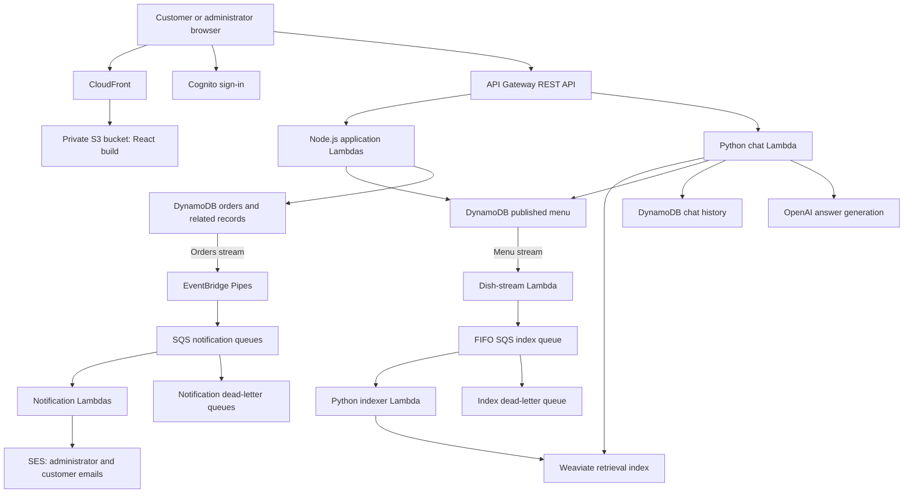

# Snowfox Pickup Ordering

A mobile-friendly React application for a sushi business, with customer accounts,
pickup orders, an administrator dashboard, and a menu assistant built with
retrieval-augmented generation (RAG). AWS Lambda runs the backend, DynamoDB stores
application data, and asynchronous workflows handle email and menu indexing.

This document translates the client brief into requirements and architecture
decisions, and distinguishes the current implementation from future work.

## Client brief

The client needs an affordable ordering application where customers can browse
the menu, create accounts, place pickup orders, and receive email updates.
Restaurant employees need to manage menu items and order status. The proposed
delivery window is **three months**, with a **$15,000 development budget**.
These are planning constraints, not claims about completed delivery or actual
project spending. Recurring hosting and AI-service costs are separate.

The initial release collects payment at pickup. Online payment is a future phase
of the broader client request.

## Requirements and current scope

| Requirement | Implementation or remaining work |
| --- | --- |
| Keep operating costs low | Use Lambda, DynamoDB on-demand capacity, static frontend hosting, and bounded RAG processing. External AI and vector-database costs must also be budgeted. |
| Handle at least 30 concurrent requests | This is a capacity target requiring load testing. Serverless deployment alone does not prove it. Chat has deliberately restrictive throttling, described below. |
| Allow frequent menu changes | Administrators publish the menu to DynamoDB; change events asynchronously refresh the RAG index. |
| Avoid losing accepted orders | Commit orders before returning success, make submission retries idempotent, and retry downstream notifications through queues. Absolute losslessness is not guaranteed. |
| Use a simple data model | DynamoDB stores menu documents and records organized around application queries. Order history and customer contact information are also stored and require protection. |
| Send confirmation emails | New orders notify the restaurant through SES. Customers receive confirmation and other status emails after staff change the order status. An immediate customer receipt for a newly submitted `PENDING` order is not implemented. |
| Add online payments later | Payment is currently collected at pickup; payment-provider integration remains future work. |
| Support pickup only | Order validation accepts pickup fulfillment. Delivery is outside the current scope. |
| Give customers another chance after missed pickups | Staff can record missed pickups, inspect customer history, and decide whether to accept or reject a later order. Automatic warnings and threshold-based rejection remain future work. |
| Help customers who do not speak English | Menu-grounded chat provides a foundation for this goal. Multilingual answer quality and interface translation still require explicit implementation or validation. |

## Architecture



The frontend distribution serves the React build from private S3 using CloudFront
Origin Access Control. Hashed frontend assets are cached; the application shell
uses a caching-disabled policy. API requests go to API Gateway rather than
through this frontend distribution. Dish images use a separate S3 bucket and
configured image URL.

Route 53 supplies DNS records, and ACM supplies the HTTPS certificate for
CloudFront. The Terraform stack uses an **existing public hosted zone**; domain
registration and creating that hosted zone are prerequisites.

### Why these services

| Service | Reason for choosing it |
| --- | --- |
| React and Vite | Build a responsive customer interface and staff dashboard as static files. |
| Lambda | Run request handlers and background workers without maintaining an always-running application server. |
| API Gateway | Provide HTTP routes, Cognito authorization, and request throttling. |
| DynamoDB on-demand | Match a small, query-oriented data model and variable traffic without provisioning fixed read/write capacity. |
| DynamoDB Streams | Start downstream processing from committed menu and order changes. |
| EventBridge Pipes | Filter and transform order stream events before sending them to notification queues. |
| SQS and dead-letter queues | Decouple background processing, retry failures, and retain failed messages for investigation and redrive. |
| SES | Send transactional order emails. The current email implementation does not use SNS. |
| S3 and CloudFront | Store images and frontend files, and distribute frontend assets near customers. |
| Cognito and IAM | Authenticate application users and restrict access to backend operations and AWS resources. |
| Secrets Manager | Keep OpenAI, Weaviate, and Cohere credentials out of frontend code and Terraform variable files. |
| CloudWatch | Collect application logs and service metrics for diagnosis and operational monitoring. |
| Terraform and GitHub Actions | Define infrastructure and automate checks, infrastructure changes, and frontend publishing. |

Lambda's maximum configurable timeout is 15 minutes, but that is not the target
latency for an order or chat request. This project configures order creation at
15 seconds, chat at 28 seconds, and the background indexer at 180 seconds by
default. Chat currently returns synchronously; it is not a queued 15-minute job.
[AWS Lambda timeout documentation](https://docs.aws.amazon.com/lambda/latest/dg/configuration-timeout.html).

## Order processing and reliability

1. A signed-in customer submits dish IDs, quantities, pickup contact details, and
   a `clientRequestId`.
2. The API loads the current menu, checks availability and whether ordering is
   enabled, and calculates prices from server-side data.
3. A DynamoDB transaction writes the order and its customer-scoped idempotency
   marker. The order begins in `PENDING` status.
4. The API returns success after that transaction commits. A retry using the
   same ID and contents returns the existing order; conflicting contents return
   an error instead of silently creating another order.
5. An order stream event passes through EventBridge Pipes to SQS. A notification
   Lambda loads the order and emails the restaurant through SES.
6. When staff update the order status, a separate stream-to-queue pipeline sends
   the applicable customer email.

Notification failures do not erase an accepted order. Queue consumers report
individual failed records, retry them, and move repeatedly failing messages to
dead-letter queues after five receives. The default queue retention is four
days; dead-letter queue retention is fourteen days.

These mechanisms do not guarantee that every attempted HTTP request is accepted
or that every email arrives exactly once. Clients must handle failed or uncertain
responses using the same request ID. Email can be duplicated after a partial
failure, and SES acceptance does not guarantee inbox delivery. DynamoDB Streams
retains records for 24 hours, and the order Pipes use a 23-hour maximum record
age; the queues therefore do not protect against an indefinitely broken upstream
consumer. Operational recovery requires monitoring, investigating dead letters,
and reconciling missed notifications against stored orders.
[DynamoDB Streams retention](https://docs.aws.amazon.com/amazondynamodb/latest/developerguide/Streams.html).

### Order status and missed pickups

| Current status | Allowed next status |
| --- | --- |
| `PENDING` | `CONFIRMED`, `CANCELLED`, or `REJECTED` |
| `CONFIRMED` | `CANCELLED`, or `FAILED_TO_PICKUP` after the scheduled pickup time |
| `CANCELLED` | No further transition |
| `REJECTED` | No further transition |
| `FAILED_TO_PICKUP` | No further transition |

The status Lambda validates these transitions, and DynamoDB conditional writes
prevent stale updates. EventBridge Pipes route changes after they are committed;
they do not enforce the business rules.

Recording a failed pickup updates the order, the customer's failure summary,
and the failure-history record in one transaction. Exact retries do not count
the same failure twice. Staff review this history when deciding how to handle
future orders. A successful-pickup completion status is not currently modeled.

## Menu data and RAG

The published menu is stored as a `MENU#CURRENT` DynamoDB document so a whole-menu
save publishes additions, edits, removals, and display order together. Order
records keep item-name and price snapshots, preserving what the customer ordered
even when the menu changes later.

Image bytes live in S3; DynamoDB stores their object keys and metadata. DynamoDB
has a **400 KB item limit**, including attribute names and values. That limit
applies to the entire published-menu document, so storing images separately does
not remove the need to bound menu text and item count.
[DynamoDB item limits](https://docs.aws.amazon.com/amazondynamodb/latest/developerguide/Constraints.html).

After a menu save, the dish-stream Lambda compares old and new dishes and sends
minimal refresh messages to a FIFO SQS queue. The indexer rereads the latest
DynamoDB menu and updates or removes deterministic Weaviate chunks. Indexing is
eventually consistent and can be rebuilt from DynamoDB. The first index build
requires an explicit rebuild because old menu data does not generate a new
stream event merely by being present.

Chat uses Weaviate hybrid retrieval, OpenAI embeddings, and Cohere reranking to
find relevant dishes. Before generating an answer, it reloads the selected dishes
from DynamoDB, removes deleted candidates, and supplies current menu facts to
OpenAI. DynamoDB remains the source of truth; the vector index is rebuildable.
Chat sessions and history are associated with the authenticated customer.

This freshness check prevents old retrieved metadata from overriding current
prices or availability, but newly added dishes may remain undiscoverable until
indexing finishes. Items without private `fullDishInfo` have no indexed chunks.
The assistant is instructed to acknowledge missing information; its answers still
need evaluation, especially for multilingual questions and allergy information.

See [the RAG architecture guide](Backend/RAG-ARCHITECTURE.md) and
[sample-data instructions](Backend/sample-data/README.md). Sample JSON files are
not automatically imported by deployment and are not a verified local inventory.

## Security and data handling

The design applies least privilege and explicit authorization: Cognito identifies
users, administrative endpoints check group membership, and customer history and
chat endpoints enforce ownership. Lambda roles receive permissions for their
specific resources. Browser-supplied prices and customer identifiers are not
trusted as authoritative values.

The application stores personal data, including email addresses, pickup names,
phone numbers, order notes, and chat history. It is therefore inaccurate to
describe the complete application as storing no sensitive information. Payment
card data is not collected by the current implementation.

RAG credentials are held in Secrets Manager, and Terraform creates only a secret
container or references an existing secret ARN. Public menu responses omit
`fullDishInfo`; relevant menu context and chat content are processed by the
configured external AI services. Frontend `VITE_*` configuration is bundled into
browser code and must never contain API secrets.

These are concrete security controls, not a claim that the project has completed
a zero-trust assessment or security audit.

## Capacity and availability

The target is at least **30 concurrent requests** with acceptable response times.
That target needs a defined traffic mix: browsing, ordering, and chat have
different costs and limits. Concurrency is also different from requests per
second.

The default chat-message throttle target is **1 request per second with a burst
of 3**, and the index queue permits at most two concurrent consumers. These are
cost controls, not evidence of support for 30 simultaneous chat submissions.
Actual environment overrides, AWS quotas, and external provider limits must be
checked during capacity testing.

Before declaring the target met, test realistic concurrent browsing and order
submission, chat throttling, retry behavior, duplicate submissions, and recovery
from notification/indexing failures. Record latency percentiles, error rates,
and queue backlog. The automated checks in this repository are not a load-test
or availability certification.

Lambda handlers keep durable application state in DynamoDB and S3, allowing
separate invocations to serve customers without relying on one process staying
alive. This is stateless compute with persistent storage, not an application
without state. Managed services reduce server maintenance, while regional and
external-service failures still require operational planning.

## Cost estimate

The following is an illustrative usage model using public USD pricing reviewed
on **October 9, 2026**, with US East (N. Virginia) rates where applicable.
Calculations exclude free-tier allowances, discounts, taxes, and unrelated
account usage. They are partial estimates, not a complete monthly quote.

Assume 300 customers per day and a 30-day month: **9,000 customer visits**.

| Component | Example calculation | Estimated monthly charge |
| --- | --- | --- |
| Chat Lambda compute | `9,000 × 60 seconds × 0.5 GB × $0.0000166667/GB-second` | **$4.50** |
| REST API requests | `9,000 × 15 requests × $3.50 / 1,000,000` | **$0.4725** |
| Order email example | Assuming one order per visit and two emails per order: `9,000 × 2 × $0.10 / 1,000` | **$1.80**, excluding email data and other SES features |

The Lambda example assumes **60 seconds of combined billable execution per
customer across chat messages**, not one 60-second invocation or one minute of
the customer leaving the chat window open. At 512 MB, compute is approximately
`$0.00000833335` per running second. The calculation must include all 60 seconds.
Lambda request charges, other handlers, and external model calls are additional.
[Lambda pricing](https://aws.amazon.com/lambda/pricing/),
[API Gateway pricing](https://aws.amazon.com/api-gateway/pricing/),
[SES pricing](https://aws.amazon.com/ses/pricing/).

Other costs to include:

| Service | Cost basis |
| --- | --- |
| [DynamoDB](https://aws.amazon.com/dynamodb/pricing/) | Standard on-demand rates include approximately $0.625 per million write request units and $0.125 per million read request units in the example region. Item size, consistency, transactions, secondary indexes, storage, and backups affect the bill. One API request is not necessarily one billable unit. |
| [DynamoDB Streams](https://aws.amazon.com/dynamodb/pricing/) | Stream-read charging depends on the consumer. Reads by Lambda triggers have no separate Streams read charge; do not assume the same exemption for every consumer. |
| [S3](https://aws.amazon.com/s3/pricing/) | Object storage, retained versions, requests, and applicable transfer charges for images, frontend files, and Terraform state. |
| [CloudFront](https://aws.amazon.com/cloudfront/pricing/) | The selected pricing plan, requests, and data delivery to visitors. |
| [Cognito](https://aws.amazon.com/cognito/pricing/) | Monthly active users, user-pool tier, and enabled features. |
| [SQS](https://aws.amazon.com/sqs/pricing/) | Sends, receives, deletes, payload sizes, and queue type; one message can incur multiple requests. |
| [EventBridge Pipes](https://aws.amazon.com/eventbridge/pricing/) | Approximately $0.40 per million requests after filtering; batching and payload size affect billable usage. |
| [Secrets Manager](https://aws.amazon.com/secrets-manager/pricing/) | $0.40 per secret per month plus $0.05 per 10,000 API calls. The three RAG API keys share one secret per environment by default. |
| [CloudWatch](https://aws.amazon.com/cloudwatch/pricing/) | Log ingestion, retention, queries, and any additional metrics or alarms. |
| [Route 53](https://aws.amazon.com/route53/pricing/) | Hosted zones and applicable DNS queries; domain registration is separate. The project reuses an existing zone. |
| [ACM](https://aws.amazon.com/certificate-manager/pricing/) and [IAM](https://aws.amazon.com/iam/) | Standard non-exportable ACM public certificates used with CloudFront and IAM roles/policies have no separate service charge. Other ACM certificate products have different pricing. |
| [KMS](https://aws.amazon.com/kms/pricing/) | Customer-managed keys, applicable rotations, and API usage if configured. The project can reference an existing key for its RAG secret. |

OpenAI generation and embedding usage, Cohere reranking, and Weaviate hosting
must be added separately using the chosen models, plans, token volumes, and
index size. Browser session duration is not a substitute for measured model
usage. Staging and production also have separate resources and usage.

## Development and deployment

The workflow uses Node.js 22, Python 3.13, and Terraform 1.14.3. For frontend
development, run these commands from the repository root:

```powershell
cd Frontend
npm ci
# Only when .env.local does not already exist:
# Copy-Item .env.example .env.local
# Set .env.local values to the intended environment's Terraform outputs.
npm run dev
```

The frontend needs a deployed API and Cognito configuration for real orders and
sign-in. Configure backend CORS for the intended frontend origin. The sample
environment file documents the public Vite settings.

Run application checks from the repository root:

```powershell
npm --prefix Frontend test
npm --prefix Frontend run lint
npm --prefix Frontend run build
npm --prefix Backend/terraform/lambda ci
npm --prefix Backend/terraform/lambda test
python -m unittest discover -s Backend/terraform/lambda-rag/tests -t Backend/terraform/lambda-rag -v
```

The GitHub workflows also check Terraform formatting and validation.
[Sushi checks](.github/workflows/checks.yml) runs on feature-branch pushes and
pull requests targeting `main` or `prod`. The deployment workflow calls these
same checks before normal planning or deployment.

| Deployment selection | Environment | Terraform workspace |
| --- | --- | --- |
| `main` | Staging | `default-staging` |
| `prod` | Production | `default-prod` |

[Sushi deployment](.github/workflows/deploy.yml) deploys on pushes to those two
branches. Manual `plan` previews infrastructure changes; manual `deploy` applies
them and publishes the frontend. The current workflow also includes manual
`destroy`, with an exact workspace confirmation and a preflight check that
application buckets are empty. Destruction removes managed application data
and infrastructure; follow the dedicated instructions before using it.

GitHub deployment requires an existing S3 state bucket and an initialized,
nonempty remote workspace. The application workflow does not create the state
bucket or migrate local state automatically. Use
[the GitHub Actions guide](.github/GitHubActions.md) for configuration, state
migration, and teardown, and [the backend guide](Backend/terraform/README.md)
for initial infrastructure setup, SES prerequisites, and RAG credentials.

## Future work

- Validate the 30-concurrent-request target with representative load tests.
- Add an immediate customer order-received email if required separately from
  staff confirmation.
- Define a missed-pickup warning and conditional rejection policy with the
  client, including when staff can override it.
- Evaluate multilingual menu questions and translate the customer interface.
- Integrate a payment provider with server-verified amounts, verified webhook
  handling, and separate payment and fulfillment states.
- Add successful pickup completion, operational alerting and recovery drills,
  and broader end-to-end customer and administrator tests.

For the data model, see [Database design](DATABASE-DESIGN.md). For API contracts
and operational detail, see [Backend documentation](Backend/terraform/README.md).
